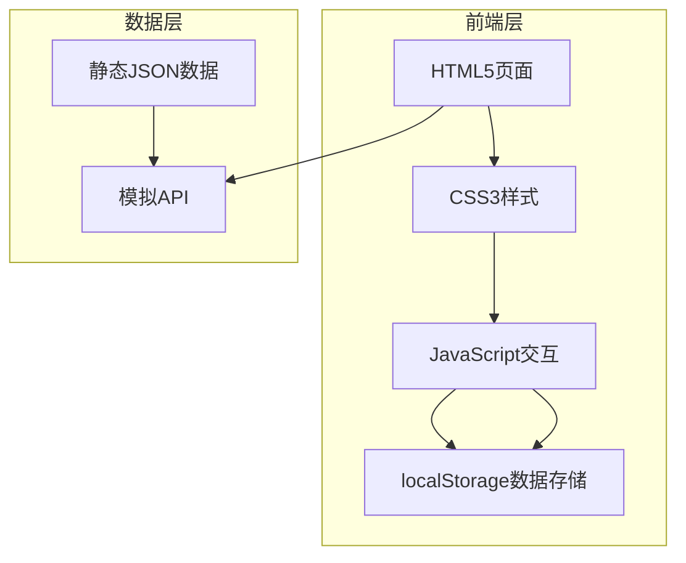

# 电影/音乐推荐网站 - 技术架构文档

## 1. Architecture Design



## 2. Technology Description

- **前端**: HTML5 + CSS3 + JavaScript (ES6+)
- **UI框架**: Bootstrap 5
- **数据存储**: localStorage + sessionStorage
- **模拟数据**: 静态JSON文件
- **目录结构**: 符合用户要求的规范

## 3. 文件结构

```
project/
├── index.html              # 首页
├── login.html              # 登录页
├── register.html           # 注册页
├── list.html               # 内容列表页
├── detail.html             # 内容详情页
├── publish.html            # 内容发布页
├── center.html             # 个人中心页
├── admin/
│   ├── index.html          # 后台首页
│   ├── goods-manage.html   # 内容管理页
│   └── user-manage.html    # 用户管理页
├── css/
│   ├── common/
│   │   ├── reset.css       # 样式重置
│   │   ├── responsive.css  # 响应式样式
│   │   └── common.css      # 通用样式
│   └── page/
│       ├── index.css       # 首页样式
│       ├── list.css        # 列表页样式
│       └── ...
├── js/
│   ├── common/
│   │   ├── utils.js        # 工具函数
│   │   ├── storage.js      # 存储管理
│   │   └── validate.js     # 表单验证
│   ├── data/
│   │   └── mock-data.js    # 模拟数据
│   └── page/
│       ├── index.js        # 首页逻辑
│       └── ...
└── assets/
    ├── images/
    └── icons/
```

## 4. 数据模型

### 4.1 用户数据 (User)
```javascript
{
  id: string,
  email: string,
  username: string,
  password: string,
  avatar: string,
  role: 'user' | 'admin',
  createdAt: string,
  favorites: string[]
}
```

### 4.2 内容数据 (Content)
```javascript
{
  id: string,
  title: string,
  type: 'movie' | 'music',
  category: string,
  year: number,
  rating: number,
  poster: string,
  description: string,
  director: string,
  actors: string[],
  duration: string,
  tags: string[],
  views: number,
  createdAt: string,
  createdBy: string
}
```

## 5. 命名规范

| 类型 | 规范 | 示例 |
|------|------|------|
| 变量/函数 | 小驼峰 (camelCase) | `userName`, `getMovieList()` |
| 组件/类 | 大驼峰 (PascalCase) | `UserManager`, `ContentCard` |
| 常量 | 全大写加下划线 (UPPER_SNAKE_CASE) | `API_BASE_URL`, `MAX_PAGE_SIZE` |
| 文件名 | 小写加连字符 (kebab-case) | `user-profile.js`, `movie-list.css` |

## 6. 核心功能实现方案

### 6.1 用户认证
- 使用 localStorage 存储用户信息和 token
- 登录/注册时验证表单
- Token 有效期验证

### 6.2 数据持久化
- 用户数据存储在 localStorage
- 内容数据使用 mock-data.js 模拟
- 收藏功能关联用户和内容

### 6.3 响应式设计
- 使用 Bootstrap 5 栅格系统
- 自定义 media queries
- 适配 PC 端和平板端

### 6.4 表单验证
- 实时验证反馈
- 邮箱格式验证
- 密码强度检查
- 必填项验证
