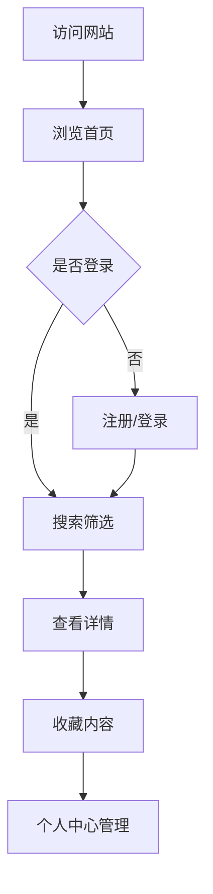

# 电影/音乐推荐网站 - 产品需求文档

## 1. Product Overview
电影/音乐推荐网站是一个纯前端开发的娱乐内容推荐平台，旨在为用户提供个性化的电影和音乐浏览、搜索、收藏服务。
- 目标用户：电影和音乐爱好者
- 市场价值：提供美观、易用的内容发现和分享平台

## 2. Core Features

### 2.1 User Roles
| Role | Registration Method | Core Permissions |
|------|---------------------|------------------|
| 普通用户 | 邮箱注册 | 浏览内容、搜索筛选、收藏、管理个人信息 |
| 管理员 | 管理员账号登录 | 内容管理、用户管理 |

### 2.2 Feature Module
1. **首页**：轮播图展示、热门推荐、分类导航
2. **登录页**：用户登录、表单验证
3. **注册页**：用户注册、表单验证
4. **列表页**：内容展示、搜索筛选、分页
5. **详情页**：内容详情展示、关联推荐
6. **个人中心**：个人信息管理、收藏列表
7. **后台管理**：内容管理、用户管理

### 2.3 Page Details
| Page Name | Module Name | Feature description |
|-----------|-------------|---------------------|
| 首页 | 轮播图 | 展示精选内容，自动轮播 |
| 首页 | 分类导航 | 快速切换电影/音乐分类 |
| 首页 | 热门推荐 | 展示热门内容卡片 |
| 登录页 | 登录表单 | 邮箱/密码输入、表单验证 |
| 注册页 | 注册表单 | 用户信息输入、实时验证 |
| 列表页 | 搜索筛选 | 按类型、评分、年份筛选 |
| 列表页 | 分页 | 分页浏览内容 |
| 详情页 | 内容展示 | 完整信息展示、评分、简介 |
| 个人中心 | 个人信息 | 查看和修改个人资料 |
| 个人中心 | 收藏列表 | 管理收藏的内容 |
| 后台管理 | 内容管理 | CRUD操作电影/音乐内容 |
| 后台管理 | 用户管理 | 查看和管理用户信息 |

## 3. Core Process

用户访问网站 → 浏览首页 → 注册/登录 → 搜索/筛选内容 → 查看详情 → 收藏内容 → 个人中心管理

## 4. User Interface Design

### 4.1 Design Style
- **主色调**：深蓝色 (#1e3a8a) + 金色 (#f59e0b)
- **辅助色**：深灰色 (#1f2937) + 白色 (#f9fafb)
- **按钮风格**：圆角按钮，带悬停渐变效果
- **字体**：Poppins + Noto Sans SC
- **布局风格**：卡片式布局，现代简约风格
- **图标风格**：线性图标，一致的视觉语言

### 4.2 Page Design Overview
| Page Name | Module Name | UI Elements |
|-----------|-------------|-------------|
| 首页 | 轮播图 | 全屏宽度，渐变背景，动画过渡 |
| 首页 | 内容卡片 | 悬停上浮，阴影增强，圆角设计 |
| 列表页 | 筛选栏 | 固定顶部，平滑滚动 |
| 详情页 | 海报展示 | 左侧大海报，右侧信息布局 |
| 表单页 | 输入框 | 浮动标签，边框动画，实时验证提示 |

### 4.3 Responsiveness
- Desktop-first 设计
- 适配 PC 端和平板端
- 触控友好的交互设计
- 响应式网格布局

### 4.4 视觉设计方向
- 现代电影/音乐娱乐平台风格
- 深色背景营造沉浸式体验
- 渐变和阴影增强层次感
- 流畅的动画和过渡效果
